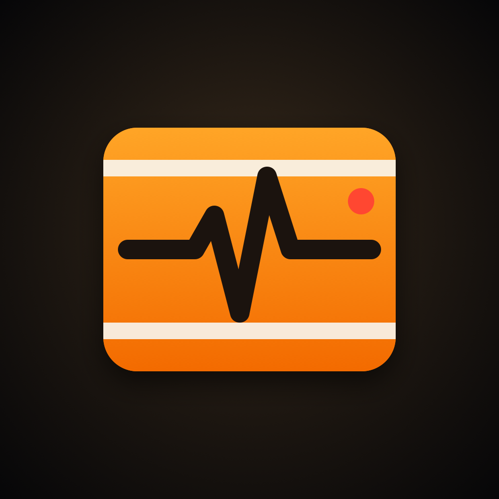
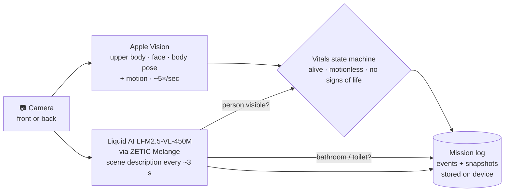

<div align="center">



# Blackbox

### Houston, we have a heartbeat.

**An on-device flight recorder for astronauts.**
Planes carry a black box. Astronauts don't. Blackbox turns an iPhone into one, with no cloud required.


[**Pitch deck (PDF)**](pitchdeck.pdf) · [PPTX](pitchdeck.pptx) · [How it works](#how-it-works) · [Run it](#getting-started)

</div>

---

## The problem

When the link to Earth drops (the far side of the Moon, a solar storm, deep space), mission control can't tell whether the crew is okay, and nothing records what happened while the link was down.

## What Blackbox does

Point an iPhone at the crew cabin. Blackbox watches, and logs every event with a timestamp and a snapshot, all on the phone:

| | Event | What triggers it |
|---|---|---|
| 🧑‍🚀 | **Astronaut detected** | A living person comes into view |
| 👁️ | **Observation** | A one-sentence, plain-English description of the scene from an on-device vision-language model |
| 🚽 | **Loo break** | The scene description says the astronaut is in a bathroom or using a toilet |
| 💔 | **No signs of life** | No movement for the alarm window: **2 hours** on a mission, **10 seconds** in demo mode |
| 💚 | **Signs of life** | Movement after an alarm. The astronaut is alive. |

The whole mission log (JSON lines plus JPEG snapshots) can be exported from the app with one tap.

> Tested on an iPhone 16 Pro in airplane mode. The scene model takes about 0.9 s per frame on-device.

## How it works

Two models run side by side on the phone:



- **Presence.** Apple Vision's upper-body, face and body-pose detectors run on the live feed. Any one of them counts. The last known position is kept through short detector dropouts, and the VLM's description ("a person is visible…") is a second, slower presence signal.
- **Motion.** Brightness change inside the person's region (a 64×48 grid, 4×4-averaged per cell to reject sensor noise) plus body-joint drift. Movement must show up in 2 of the last 3 samples, so one noisy frame can't reset the alarm.
- **Scene understanding.** Frames are rotated upright, downscaled to 448 px and passed to `zetic/LFM2.5-VL-450M` through the Melange SDK. The model is downloaded once and then runs fully offline.
- **Loo detection.** Bathroom keywords in the scene description, ignored when negated ("*not* a bathroom") and debounced to one event per 30 s.

| File | Role |
|---|---|
| [`CameraService.swift`](Blackbox/Sources/CameraService.swift) | Front/back camera capture and preview |
| [`HumanMonitor.swift`](Blackbox/Sources/HumanMonitor.swift) | Vision presence detection and motion scoring |
| [`SceneObserver.swift`](Blackbox/Sources/SceneObserver.swift) | Melange LFM2.5-VL model: load, frame to RGB, describe |
| [`BlackboxEngine.swift`](Blackbox/Sources/BlackboxEngine.swift) | Vitals state machine, observation loop, loo detection |
| [`FlightRecorder.swift`](Blackbox/Sources/FlightRecorder.swift) | Append-only mission log and snapshots |
| [`ContentView.swift`](Blackbox/Sources/ContentView.swift) | The mission-control UI |

## Getting started

**You need:** a Mac with Xcode, a physical iPhone running iOS 17+ (the Melange SDK doesn't run in the Simulator), and a free [Melange](https://melange.zetic.ai) account.

```bash
git clone https://github.com/Abhinav-ranish/blackbox-lunar.git
cd blackbox-lunar/Blackbox
cp Secrets.xcconfig.example Secrets.xcconfig
```

1. Create a Personal Access Token at [Melange → Settings → Personal Access Tokens](https://melange.zetic.ai/settings?tab=pat) and paste it after `MELANGE_PERSONAL_KEY =` in `Secrets.xcconfig` (it's gitignored).
2. Open `Blackbox.xcodeproj`, select your own signing team, and run on your iPhone. If you edit `project.yml`, regenerate the project with `xcodegen generate`.
3. On first launch, allow camera access and stay online while the model downloads. After that, airplane mode is fine.

Use the **10 s demo / 2 h** switch to pick the alarm window, and the camera button to flip between the front and back camera.

## Built with

- [**Liquid AI LFM2.5-VL-450M**](https://www.liquid.ai/models): small vision-language model built for the edge
- [**ZETIC Melange**](https://melange.zetic.ai): on-device deployment, benchmarked on real devices ([iOS SDK](https://github.com/zetic-ai/ZeticMLangeiOS) 1.11.0)
- **Apple Vision, AVFoundation, SwiftUI**

Built at **Houston, We Have No Cloud**, the ZETIC × Liquid AI on-device AI workshop at SF Tech Week, October 6, 2026.

## What's next

- [ ] Wearable version for spacesuits: heart rate plus motion
- [ ] Crew-wide dashboard that syncs when the link comes back
- [ ] Long mission logs searchable with on-device RAG

---

<div align="center">

**Your AI. Your device. No cloud required.**

</div>
